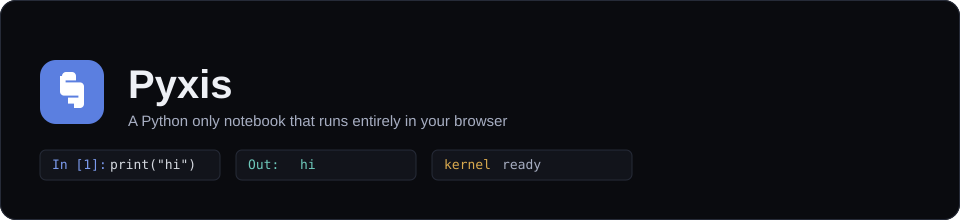
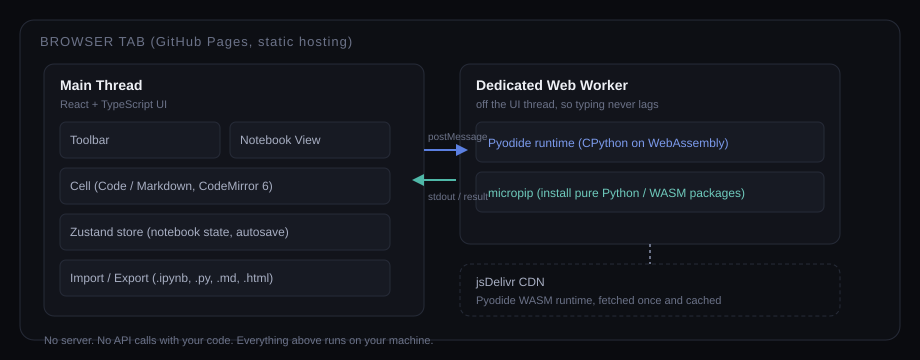

<div align="center">



<br />

[](https://github.com/hassanireza/pyxis/actions)
[](https://hassanireza.github.io/pyxis/)
[](https://www.typescriptlang.org/)
[](https://react.dev/)
[](https://pyodide.org/)
[](./LICENSE)

**A Python notebook and a Markdown workspace, both running entirely in your browser.**

No server. No account. No data ever leaves your machine.

This is a private portfolio project, shared for viewing only.

</div>

<br />

## What is Pyxis

Pyxis is two tools in one page, switched with a single toggle in the toolbar:

- **Notebook** — a computational notebook for Python, in the spirit of Jupyter, running a real CPython interpreter client side through [Pyodide](https://pyodide.org/) (CPython compiled to WebAssembly), inside a dedicated Web Worker, so the interface stays responsive while code executes.
- **MD Previewer** — a Markdown workspace with a Write / Markdown / Preview switch. Write is a true WYSIWYG surface (built on [Tiptap](https://tiptap.dev/)): click Bold and the selection turns bold immediately, no typed `**` or `#` required. Markdown is the raw source, editable directly. Preview is the final rendered HTML. All three stay in sync with each other automatically.

Both modes are built for their one job on purpose, instead of trying to be a generic multi-purpose tool.

<br />

## Interface

<table>
<tr>
<td width="50%" valign="top">

**Code cells**
Split into two panes: the editor on the left, live output on the right. Toggle Live mode on a cell and it re-executes automatically a moment after you stop typing.

</td>
<td width="50%" valign="top">

**Notebook markdown cells**
An explicit Edit / Preview switch, GitHub flavored Markdown rendering (tables, task lists, strikethrough), and no hidden focus behavior to fight with.

</td>
</tr>
<tr>
<td width="50%" valign="top">

**Kernel controls**
A status pill shows Offline, Starting, Ready, Running, or Error, live in the toolbar. Restart Kernel actually reboots the interpreter and clears every cell's output and execution count.

</td>
<td width="50%" valign="top">

**Import and export**
Bring in an existing `.ipynb`, or ship your work out to Jupyter, plain Python, Markdown, or a standalone HTML page.

</td>
</tr>
<tr>
<td width="50%" valign="top">

**MD Previewer — Write**
A word-processor-style formatting toolbar (bold, italic, headings, lists, task lists, quotes, code, tables, links, images, undo/redo) that edits a real WYSIWYG document, not a text field with hotkeys.

</td>
<td width="50%" valign="top">

**MD Previewer — Markdown / Preview**
Switch to raw Markdown source at any time, or to the fully rendered HTML preview. Import an existing `.md` file, and export both `.md` and a self-contained styled `.html` document, or copy either straight to the clipboard.

</td>
</tr>
</table>

<br />

## Architecture



The UI (React, Zustand for state) lives on the main thread and never touches the interpreter directly. All Python execution happens in a dedicated Web Worker running Pyodide, communicating back over `postMessage` with streamed stdout and stderr, so a long running cell cannot freeze the editor. The Pyodide WASM runtime itself is fetched from a CDN on first load and cached by the browser afterward.

The MD Previewer runs entirely client side too: a single shared Tiptap extension set is used both for the interactive Write surface and for a headless (never rendered to screen) editor instance that generates the Preview tab and the exported `.html`, so all three views are always byte-for-byte in sync.

<br />

## Feature list

| Area | Details |
|---|---|
| Editor | CodeMirror 6, Python syntax highlighting, line numbers, code folding, autocomplete |
| Execution | Real CPython via Pyodide/WebAssembly, off the main thread, streamed stdout/stderr |
| Live mode | Optional per cell auto-run, debounced, with a split code/output view |
| Auto display | The value of a cell's last expression is shown automatically, matching IPython behavior |
| Notebook markdown | GitHub Flavored Markdown, explicit edit/preview toggle |
| Kernel | Status indicator, restart, run all, clear outputs (single cell or whole notebook) |
| Packages | Install pure Python or WASM compatible packages at runtime with micropip |
| MD Previewer — Write | WYSIWYG toolbar: bold, italic, strikethrough, headings, blockquote, inline/block code, bullet/numbered/task lists, links, images (URL or upload), tables, horizontal rule, undo/redo, clear formatting |
| MD Previewer — views | Write (WYSIWYG), Markdown (raw source), Preview (rendered HTML), all kept in sync |
| MD Previewer — import/export | Import `.md`, export `.md` and self-contained `.html`, copy Markdown or HTML to clipboard |
| Persistence | Autosaves to local storage on every change, survives a refresh — Notebook and MD Previewer each have their own autosave |
| Import | `.ipynb` (Jupyter nbformat 4), Pyxis's own `.json` state, `.md` for the previewer |
| Export | `.ipynb`, `.py` (percent cell format), `.md`, standalone `.html`, `.json` |
| Shortcuts | Ctrl/Cmd+Enter to run, Shift+Enter to run and advance |

<br />

## Export formats

<table>
<tr><th align="left">Format</th><th align="left">Use it for</th></tr>
<tr><td><code>.ipynb</code></td><td>Opening in Jupyter, JupyterLab, or VS Code</td></tr>
<tr><td><code>.py</code></td><td>Percent cell format, compatible with VS Code, Spyder, and Jupytext</td></tr>
<tr><td><code>.md</code></td><td>Documentation, blog posts, GitHub READMEs — from the notebook or the MD Previewer</td></tr>
<tr><td><code>.html</code></td><td>A single file you can send to anyone, no notebook or Markdown viewer required</td></tr>
<tr><td><code>.json</code></td><td>Pyxis's own lossless internal state, for round tripping between sessions</td></tr>
</table>

<br />

## Design system

Pyxis follows the same **Abyssal Liturgy** identity as the rest of [hassanireza.github.io](https://hassanireza.github.io) — near-black surfaces, a single restrained accent, and a couple of desaturated status hues kept small so they never compete with it:

<table>
<tr>
<td align="center" width="16.6%"><br /><sub>Oxidized silver / accent</sub></td>
<td align="center" width="16.6%"><br /><sub>Muted teal / ready, live</sub></td>
<td align="center" width="16.6%"><br /><sub>Muted amber / running, warning</sub></td>
<td align="center" width="16.6%"><br /><sub>Muted coral / error</sub></td>
<td align="center" width="16.6%"><br /><sub>Void / surface</sub></td>
<td align="center" width="16.6%"><br /><sub>Bone / text</sub></td>
</tr>
</table>

Typography follows the same three-role system as the brand: **Cormorant Garamond** (italic) for display moments like the wordmark and document headings, **Jost** for interface text and prose, and **JetBrains Mono** for code, timestamps, and the small uppercase labels used throughout the chrome. Every icon in the app is a hand drawn inline SVG, no icon font, no external icon package.

<br />

## Tech stack

- React 18 and TypeScript
- Vite for building and bundling
- Zustand for state management
- CodeMirror 6 for the code and Markdown source editors
- react-markdown with remark-gfm for notebook markdown cell rendering
- Tiptap 3 with tiptap-markdown for the MD Previewer's WYSIWYG editor
- Pyodide, loaded from a CDN at runtime, running inside a dedicated Web Worker

<br />

## Project structure

```
src/
  components/          Toolbar, cells, output renderer, icons, toasts, mode switch
  components/previewer/  MD Previewer toolbar, formatting toolbar, Write/Markdown/Preview surfaces
  lib/                 Pyodide worker, runtime bridge, import/export utilities (notebook + previewer)
  store/                Zustand stores: notebook state/execution/notifications, previewer document
  types.ts              Shared TypeScript types for the notebook model
public/
  logo.svg              Favicon / brand mark
  404.html               GitHub Pages SPA fallback
.github/
  assets/                README diagrams
  workflows/deploy.yml     Build and deploy workflow for GitHub Pages
```

<br />

## Notes on the Python runtime

Pyodide ships a large subset of the Python standard library and can install many pure Python packages from PyPI through micropip, along with a growing set of packages already compiled to WebAssembly (numpy, pandas, and others). Packages that depend on native extensions without a WASM build will not install. The first cell run after a fresh page load takes a few seconds while the interpreter finishes booting, reflected by the kernel status pill in the toolbar.

<br />

## License

All rights reserved. This is a private portfolio project, shared publicly for viewing and demonstration purposes only. No use, copying, modification, or redistribution is permitted without explicit written permission from the author. See [LICENSE](./LICENSE).
